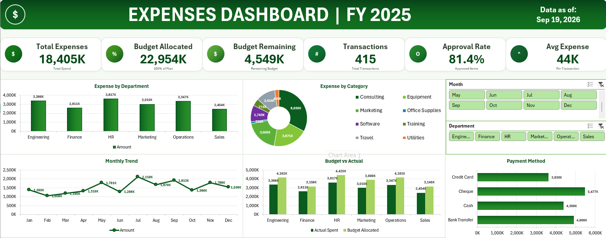

# Excel Sales Analytics Dashboard

## Project Overview

An interactive sales analytics dashboard developed using Microsoft Excel to transform raw sales data into meaningful business insights. The project includes data preparation, PivotTables, calculations, KPI analysis, interactive filtering, and data visualization within a single Excel workbook.

## Objectives

* Analyze overall sales performance
* Track key business KPIs
* Identify sales trends over time
* Analyze product and category performance
* Compare regional performance
* Identify high-performing products and customers
* Present business insights through an interactive dashboard

## Tools & Technologies

* Microsoft Excel
* PivotTables
* PivotCharts
* Excel Functions
* Slicers
* Data Cleaning
* Data Analysis
* Data Visualization

## Dashboard Preview



## Project Workflow

```text
Raw Data
   ↓
Data Cleaning & Preparation
   ↓
PivotTables & Calculations
   ↓
Data Analysis
   ↓
Interactive Dashboard
   ↓
Business Insights
```

## Key Analysis

### Sales Performance

Analyzed overall sales performance using KPIs and visualizations to understand revenue and order trends.

### Product & Category Analysis

Analyzed product and category performance to identify products and categories contributing to overall sales.

### Regional Analysis

Compared sales performance across different regions to identify variations in regional contribution.

### Time-Based Analysis

Analyzed sales trends across different time periods to identify changes and patterns in business performance.

### Customer Analysis

Analyzed customer-level sales information to identify purchasing patterns and high-value customers.

## Key Insights

* Identified important sales trends and performance patterns.
* Compared product and category-level performance.
* Analyzed regional contribution to overall sales.
* Identified high-performing products and customers.
* Used interactive filters to explore the data from different perspectives.

## Excel Workbook Structure

The complete analysis is maintained in a single Excel workbook containing:

* Raw Data
* Data Preparation / Calculations
* PivotTables
* Dashboard

## How to Use

1. Download `EXPENSES DASHBOARD.xlsx` from the `dashboard` folder.
2. Open the workbook using Microsoft Excel.
3. Navigate to the Dashboard sheet.
4. Use the available slicers and filters to interact with the dashboard.
5. Explore the KPIs, charts, PivotTables, and analysis.

## Skills Demonstrated

* Data Cleaning
* Data Analysis
* Microsoft Excel
* PivotTables
* PivotCharts
* KPI Development
* Data Visualization
* Dashboard Development
* Business Reporting
* Business Insights

## Project Files

| File                             | Description                                                                   |
| -------------------------------- | ----------------------------------------------------------------------------- |
| `EXPENSES DASHBOARD.xlsx`        | Complete Excel workbook containing data, analysis, PivotTables, and dashboard |
| `dashboard.png`                  | Dashboard preview                                                             |

## Author

**Dhayalan B**

GitHub: [DhayalanSD](https://github.com/DhayalanSD)

Portfolio: [Dhayalan B Portfolio](https://dhayalan-b.vercel.app/)
